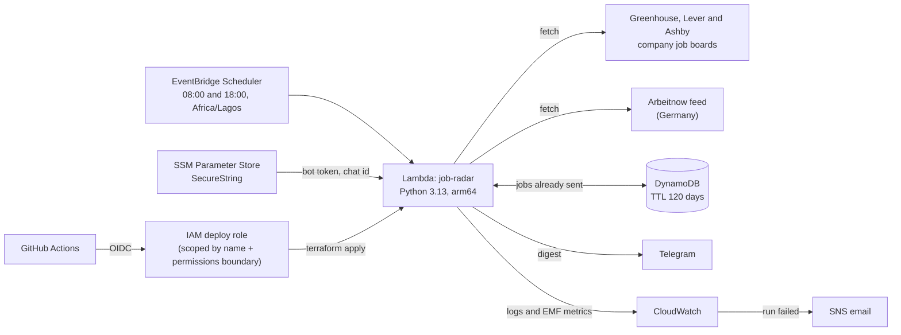

# Job Radar

Twice a day, Job Radar reads the public job boards of companies that hire in visa-friendly European
countries, keeps the DevOps, SRE, platform and cloud roles, reads each ad for visa and relocation
signals, and sends only the **new** matches to Telegram.

It runs on AWS Lambda, is deployed with Terraform through GitHub Actions (OIDC, no stored keys), and
stays inside AWS's always-free limits.

An example digest (companies made up):

```text
Job Radar: 2 new roles

Site Reliability Engineer
Northwind Payments · Berlin
Mentions visa or relocation support
Open the job

Platform Engineer, Observability
Contoso Cloud · Amsterdam
Sponsorship not mentioned · Asks for Dutch
Open the job
```

## Architecture



Each run:

1. Fetches every configured board in parallel. A board that is down is reported, not fatal.
2. Keeps roles whose **title** matches (DevOps, SRE, platform, cloud...) and whose **location** is in
   a target country, or that are remote for EMEA or worldwide.
3. Reads each ad sentence by sentence and labels it *mentions visa or relocation support*,
   *unclear*, *not mentioned* or *excludes sponsorship*. Ads that exclude sponsorship, or require an
   existing work permit, are dropped. Ads that ask for German, Dutch and so on are flagged.
4. Drops jobs already sent (DynamoDB), sends the rest, sponsorship-friendly ads first, and only then
   records them, so a failed send is retried on the next run.

## What it costs

| Service | Use per month | Cost |
|---|---|---|
| Lambda | ~60 runs of a few seconds | Always-free tier: 1M requests, 400,000 GB-seconds |
| DynamoDB | a few hundred reads and writes | 5 RCU / 5 WCU provisioned, inside the always-free 25 / 25 |
| EventBridge Scheduler | ~60 invocations | Priced per million, rounds to $0.00 |
| SSM Parameter Store | 2 standard SecureString parameters | No charge for standard parameters; AWS managed KMS key |
| CloudWatch | 4 custom metrics, 1 alarm, a few MB of logs (14-day retention) | Always-free tier: 10 metrics, 10 alarms, 5 GB of logs |
| S3 (Terraform state) | a few KB | Fractions of a cent |

Things that would cost money were left out on purpose: no VPC (it would need a NAT gateway, about
$32 a month), no customer-managed KMS keys ($1 a month each), no point-in-time recovery.

## Security

- **No AWS keys in GitHub.** The deploy workflow signs in with GitHub's OIDC token. Only jobs in
  the `production` environment of this repository can assume the deploy role.
- **The deploy role cannot escalate.** It can only touch resources whose names start with
  `job-radar`, can only create or change roles that carry the `job-radar-workload-boundary`
  permissions boundary, and is explicitly denied any change to itself or to that boundary.
- **Least-privilege runtime.** The Lambda can write its own logs, read and write one table, and
  read two parameters. Nothing else.
- **Secrets never touch code, plans or state.** Terraform creates the SSM parameters with a
  placeholder and ignores their value; the real values are set once with the AWS CLI. Error
  messages redact the Telegram URL, which contains the token.
- **Scanned on every push.** Checkov checks the Terraform (every skipped check has a written reason
  next to the resource), and Trivy scans the repository for secrets and vulnerable dependencies.

## Setup

You need an AWS account, Terraform 1.10 or newer, Python 3.11 or newer, the AWS CLI and a Telegram
account. For the one-time setup, sign the CLI in as an IAM user with admin rights and MFA (never
the root user). Once GitHub deploys work, you can delete that user's access keys.

Every service used here is available on AWS's free account plan.

### 1. Create the Telegram bot

1. In Telegram, message [@BotFather](https://t.me/BotFather), send `/newbot` and copy the token.
   Keep it private.
2. Send your new bot any message, such as "hi".
3. Get your chat id without putting the token in your shell history:

   ```bash
   read -rs TELEGRAM_BOT_TOKEN && export TELEGRAM_BOT_TOKEN
   make chat-id
   ```

### 2. Try it locally (no AWS needed)

```bash
make install
make check-boards   # every board should answer OK
make dry-run        # prints what would be sent right now
```

### 3. Bootstrap AWS (once)

Creates the Terraform state bucket, the GitHub OIDC provider, the deploy role and the permissions
boundary. Use your own `owner/repo`.

```bash
cd infra/bootstrap
terraform init
terraform apply -var="github_repository=Faozil/job-radar"
```

Its output prints the next commands. Keep `infra/bootstrap/terraform.tfstate`; it is git-ignored.

### 4. Deploy the main stack (once from your laptop)

```bash
terraform -chdir=infra/main init \
  -backend-config="bucket=<state_bucket from the bootstrap output>" \
  -backend-config="region=eu-west-1"
terraform -chdir=infra/main apply -var="alert_email=you@example.com"
```

AWS emails you a link to confirm the alert subscription. Commit the `.terraform.lock.hcl` files
that `terraform init` created.

### 5. Store the Telegram settings

```bash
read -rs TOKEN
aws ssm put-parameter --region eu-west-1 --name /job-radar/telegram/bot-token \
  --type SecureString --overwrite --value "$TOKEN"
unset TOKEN
aws ssm put-parameter --region eu-west-1 --name /job-radar/telegram/chat-id \
  --type SecureString --overwrite --value "<your chat id>"
```

Run it once to check (the command is also in the Terraform output):

```bash
aws lambda invoke --region eu-west-1 --function-name job-radar \
  --cli-binary-format raw-in-base64-out --payload '{}' /dev/stdout
```

### 6. Let GitHub Actions deploy from now on

In the repository, open **Settings > Secrets and variables > Actions > Variables** and add:

| Variable | Value |
|---|---|
| `AWS_REGION` | `eu-west-1` |
| `AWS_DEPLOY_ROLE_ARN` | `deploy_role_arn` from the bootstrap output |
| `TF_STATE_BUCKET` | `state_bucket` from the bootstrap output |
| `ALERT_EMAIL` | optional, your email for failure alerts |

Every push to `main` that changes `src/`, `config/` or `infra/main/` now runs the tests and
`terraform apply`. To require your approval first, add a required reviewer to the `production`
environment under **Settings > Environments**.

## Configuration

Everything lives in [`config/job-radar.toml`](config/job-radar.toml): the boards, the title
patterns, the locations, the remote regions and the languages to flag. Edit it, check it with
`make check-boards` and `make dry-run`, then push.

To add a company, open its careers page and look at where the job links go:

| Job links go to | Add |
|---|---|
| `job-boards.greenhouse.io/<id>` or `boards.greenhouse.io/<id>` | `source = "greenhouse"`, `id = "<id>"` |
| `jobs.lever.co/<id>` | `source = "lever"`, `id = "<id>"` |
| `jobs.eu.lever.co/<id>` | `source = "lever"`, `id = "<id>"`, `region = "eu"` |
| `jobs.ashbyhq.com/<id>` | `source = "ashby"`, `id = "<id>"` |

## Running without AWS

[`.github/workflows/radar.yml`](.github/workflows/radar.yml) runs the same code on GitHub
Actions, free for public repositories. Start it from the Actions tab for a dry run, or uncomment its
schedule and add `TELEGRAM_BOT_TOKEN` and `TELEGRAM_CHAT_ID` as repository secrets to use it
instead of AWS. It keeps the list of jobs already sent in the Actions cache.

## Observability

Each run prints one JSON line, so CloudWatch Logs Insights can query it directly:

```text
fields @timestamp, fetched, matched, new, notified, failed
| filter event = "run_complete"
| sort @timestamp desc
```

It also publishes `JobsFetched`, `Matches`, `NewJobs` and `BoardErrors` in the `JobRadar` namespace
through the Embedded Metric Format, which costs no API calls. A failed run raises the
`job-radar-errors` alarm and sends an email.

## Development

| Command | What it does |
|---|---|
| `make test` | Unit tests (no network needed) |
| `make lint` | Ruff and `terraform fmt -check` |
| `make format` | Fix formatting |
| `make scan` | Checkov on the Terraform |
| `make dry-run` | Print what would be sent right now |
| `make check-boards` | Check every configured board answers |

On Windows, run these inside WSL, or run the commands from the `Makefile` directly with
`PYTHONPATH=src` set.

```text
src/jobradar/
  sources/        Greenhouse, Lever, Ashby and Arbeitnow adapters
  filters.py      title, location, freshness, sponsorship and language rules
  pipeline.py     fetch -> filter -> de-duplicate -> notify -> remember
  store.py        DynamoDB, file and in-memory stores
  notify.py       Telegram and console notifiers
  handler.py      Lambda entry point
  cli.py          local commands
infra/bootstrap/  state bucket, GitHub OIDC, deploy role, permissions boundary
infra/main/       Lambda, Scheduler, DynamoDB, SSM, alarm
config/           job-radar.toml
tests/            unit tests
```

## Roadmap

- More sources: Workday and SmartRecruiters boards, and an Indeed adapter
- A weekly summary of how many matching roles each company posted
- `terraform test` coverage for the IAM boundary rules

## Author

Built by [Abdul-Faozil Majekodunmi](https://linkedin.com/in/abdul-faozil), DevOps engineer.
MIT licensed.
