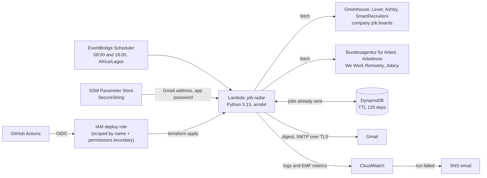

# Job Radar

Twice a day, Job Radar reads the public job boards of companies that hire in visa-friendly European
countries, Germany's federal job board and a few remote-job feeds. It keeps the DevOps, SRE,
platform and cloud roles, reads each ad for visa and relocation signals, and emails you only the
**new** matches.

It runs on AWS Lambda, is deployed with Terraform through GitHub Actions (OIDC, no stored keys), and
stays inside AWS's always-free limits.

An example digest (companies made up):

```text
Subject: Job Radar: 2 new roles (9 Oct)

Site Reliability Engineer
Northwind Payments · Berlin
Mentions visa or relocation support
https://example.com/jobs/123

Platform Engineer, Observability
Contoso Cloud · Amsterdam
Sponsorship not mentioned · Asks for Dutch
https://example.com/jobs/456
```

## Architecture



Each run:

1. Fetches every board and feed in parallel. One that is down is reported, not fatal.
2. Keeps roles whose **title** matches (DevOps, SRE, platform, cloud...) and whose **location** is in
   a target country, or that are remote for EMEA or worldwide, and drops jobs already sent
   (DynamoDB).
3. Reads each remaining ad sentence by sentence and labels it *mentions visa or relocation
   support*, *unclear*, *not mentioned* or *excludes sponsorship*. Some feeds only list titles, so
   their full ads are fetched at this point, for these few jobs only. Ads that exclude sponsorship,
   require an existing work permit or are written in German are dropped. Ads that ask for German,
   Dutch and so on are flagged.
4. Emails the rest, sponsorship-friendly ads first, and only then records them, so a failed email
   is retried on the next run.

## What it costs

| Service | Use per month | Cost |
|---|---|---|
| Lambda | ~60 runs of about 30 seconds at 512 MB (~900 GB-seconds) | Always-free tier: 1M requests, 400,000 GB-seconds |
| DynamoDB | a few hundred reads and writes | 5 RCU / 5 WCU provisioned, inside the always-free 25 / 25 |
| EventBridge Scheduler | ~60 invocations | Priced per million, rounds to $0.00 |
| SSM Parameter Store | 2 standard SecureString parameters | No charge for standard parameters; AWS managed KMS key |
| Gmail SMTP | ~60 emails | Free |
| CloudWatch | 4 custom metrics, 1 alarm, a few MB of logs (14-day retention) | Always-free tier: 10 metrics, 10 alarms, 5 GB of logs |
| S3 (Terraform state) | a few KB | Fractions of a cent |

Things that would cost money were left out on purpose: no VPC (it would need a NAT gateway, about
$32 a month), no customer-managed KMS keys ($1 a month each), no point-in-time recovery.

## Security

- **No AWS keys in GitHub.** The deploy workflow signs in with GitHub's OIDC token. Only jobs in
  the `production` environment of this repository can assume the deploy role.
- **The deploy role cannot escalate.** It can only touch resources whose names start with
  `job-radar`, can only create or change roles that carry the `job-radar-workload-boundary`
  permissions boundary, and is explicitly denied any change to itself or to that boundary.
- **Least-privilege runtime.** The Lambda can write its own logs, read and write one table, and
  read two parameters. Nothing else.
- **Secrets never touch code, plans or state.** Terraform creates the SSM parameters with a
  write-only placeholder (`value_wo`), so the real values, set once with the AWS CLI, are never
  read back into state. Mail goes out over TLS with certificate checks, using a Gmail app password
  that can be revoked on its own.
- **Scanned on every push.** Checkov checks the Terraform (every skipped check has a written reason
  next to the resource), and Trivy scans the repository for secrets and vulnerable dependencies.

## Setup

You need an AWS account, Terraform 1.11 or newer, Python 3.11 or newer, the AWS CLI and a Gmail
account with 2-Step Verification. For the one-time setup, sign the CLI in as an IAM user with admin rights and MFA (never
the root user). Once GitHub deploys work, you can delete that user's access keys.

Every service used here is available on AWS's free account plan.

### 1. Create a Gmail app password

1. Turn on 2-Step Verification for your Google account if it isn't on already, with a phone or an
   authenticator app as a second step. Until then, the App passwords page says "The setting you
   are looking for is not available for your account". Work or school accounts may not offer app
   passwords at all, so use a personal Gmail.
2. Open [App passwords](https://myaccount.google.com/apppasswords), create one called `job-radar`
   and copy the 16 characters. Treat it like a password: it gives mail access to the account. You
   can revoke it on the same page at any time.
3. Send yourself a test email, without putting the password in your shell history:

   ```bash
   export EMAIL_ADDRESS=you@gmail.com
   read -rs EMAIL_APP_PASSWORD && export EMAIL_APP_PASSWORD
   make test-email
   ```

### 2. Try it locally (no AWS needed)

```bash
make install
make check-boards   # every board should answer OK
make dry-run        # prints what would be sent right now
```

### 3. Bootstrap AWS (once)

Creates the Terraform state bucket, the GitHub OIDC provider, the deploy role and the permissions
boundary. Use your own `owner/repo`, with the exact case GitHub shows: the deploy role's trust
policy compares it case-sensitively.

```bash
cd infra/bootstrap
terraform init
terraform apply -var="github_repository=Faozil/Job-Radar"
```

Its output prints the next commands. Keep `infra/bootstrap/terraform.tfstate`; it is git-ignored.

### 4. Deploy the main stack (once from your laptop)

```bash
terraform -chdir=infra/main init \
  -backend-config="bucket=<state_bucket from the bootstrap output>" \
  -backend-config="region=eu-west-1"
terraform -chdir=infra/main apply -var="alert_email=you@example.com"
```

AWS emails you a link to confirm the alert subscription. Commit the `.terraform.lock.hcl` files
that `terraform init` created.

### 5. Store the email settings

```bash
aws ssm put-parameter --region eu-west-1 --name /job-radar/email/address \
  --type SecureString --overwrite --value "you@gmail.com"
read -rs PASSWORD
aws ssm put-parameter --region eu-west-1 --name /job-radar/email/app-password \
  --type SecureString --overwrite --value "$PASSWORD"
unset PASSWORD
```

Run it once to check (the command is also in the Terraform output):

```bash
aws lambda invoke --region eu-west-1 --function-name job-radar \
  --cli-binary-format raw-in-base64-out --payload '{}' /dev/stdout
```

### 6. Let GitHub Actions deploy from now on

In the repository, open **Settings > Secrets and variables > Actions > Variables** and add:

| Variable | Value |
|---|---|
| `AWS_REGION` | `eu-west-1` |
| `AWS_DEPLOY_ROLE_ARN` | `deploy_role_arn` from the bootstrap output |
| `TF_STATE_BUCKET` | `state_bucket` from the bootstrap output |
| `ALERT_EMAIL` | optional, your email for failure alerts |

Every push to `main` that changes `src/`, `config/` or `infra/main/` now runs the tests and
`terraform apply`. To require your approval first, add a required reviewer to the `production`
environment under **Settings > Environments**.

## Configuration

Everything lives in [`config/job-radar.toml`](config/job-radar.toml): the boards, the feeds, the
title patterns, the locations, the remote regions and the languages to flag. Edit it, check it with
`make check-boards` and `make dry-run`, then push.

To add a company, open its careers page and look at where the job links go:

| Job links go to | Add |
|---|---|
| `job-boards.greenhouse.io/<id>` or `boards.greenhouse.io/<id>` | `source = "greenhouse"`, `id = "<id>"` |
| `jobs.lever.co/<id>` | `source = "lever"`, `id = "<id>"` |
| `jobs.eu.lever.co/<id>` | `source = "lever"`, `id = "<id>"`, `region = "eu"` |
| `jobs.ashbyhq.com/<id>` | `source = "ashby"`, `id = "<id>"` |
| `jobs.smartrecruiters.com/<id>` | `source = "smartrecruiters"`, `id = "<id>"` |

The feeds each have a `[feeds.<name>]` section and can be switched off with `enabled = false`:

| Feed | What it adds |
|---|---|
| `bundesagentur` | Germany's federal job board, without recruitment and temp agencies. Not an official API: it is the one the agency's own site uses, [documented by bundesAPI](https://github.com/bundesAPI/jobsuche-api). |
| `arbeitnow` | A German job board aggregator |
| `weworkremotely` | Remote DevOps and sysadmin jobs (RSS) |
| `jobicy` | Remote jobs by tag |

`skip_german_ads = true` drops ads written in German, which is most of what the federal job board
lists.

A few rules worth knowing:

- Junior, mid and senior roles pass. Staff level and above, managers, interns and freelance roles
  don't.
- `max_age_days` only applies to the feeds. Company boards only list open jobs, and some keep a
  role open for years, so an age limit there would hide real openings.
- "Systems Engineer" only counts with an IT word in the title, because on its own it is often
  aerospace or medical-device work.
- Some place names are left out because they exist in other countries too, such as Cambridge
  (Massachusetts) and Wales (New South Wales). Jobs there still match through "UK" or "United
  Kingdom".

### Why not LinkedIn, Indeed or Glassdoor?

None of them has a public job search API. Indeed closed its publisher API to new developers, Glassdoor
closed its API to new partners, and LinkedIn's job APIs are for approved partners posting jobs, not
for reading them. All three forbid scraping in their terms. Their own email alerts cover them better
than a scraper would.

## Running without AWS

[`.github/workflows/radar.yml`](.github/workflows/radar.yml) runs the same code on GitHub
Actions, free for public repositories. Start it from the Actions tab for a dry run, or uncomment its
schedule and add `EMAIL_ADDRESS` and `EMAIL_APP_PASSWORD` as repository secrets to use it
instead of AWS. It keeps the list of jobs already sent in the Actions cache.

## Observability

Each run prints one JSON line, so CloudWatch Logs Insights can query it directly:

```text
fields @timestamp, fetched, matched, new, notified, failed
| filter event = "run_complete"
| sort @timestamp desc
```

It also publishes `JobsFetched`, `Matches`, `NewJobs` and `BoardErrors` in the `JobRadar` namespace
through the Embedded Metric Format, which costs no API calls. A failed run raises the
`job-radar-errors` alarm, which emails you through SNS. That path doesn't use Gmail, so a revoked
app password still gets reported.

## Development

| Command | What it does |
|---|---|
| `make test` | Unit tests (no network needed) |
| `make lint` | Ruff and `terraform fmt -check` |
| `make format` | Fix formatting |
| `make scan` | Checkov on the Terraform |
| `make dry-run` | Print what would be sent right now |
| `make check-boards` | Check every board and feed answers, and count its candidates |
| `make test-email` | Send a test email with your settings |

On Windows, run these inside WSL, or run the commands from the `Makefile` directly with
`PYTHONPATH=src` set.

```text
src/jobradar/
  sources/        one adapter per board or feed
  filters.py      title, location, freshness, sponsorship and language rules
  pipeline.py     fetch -> filter -> skip seen -> read ads -> classify -> notify -> remember
  store.py        DynamoDB, file and in-memory stores
  notify.py       email (SMTP) and console notifiers
  handler.py      Lambda entry point
  cli.py          local commands
infra/bootstrap/  state bucket, GitHub OIDC, deploy role, permissions boundary
infra/main/       Lambda, Scheduler, DynamoDB, SSM, alarm
config/           job-radar.toml
tests/            unit tests
```

## Roadmap

- More sources: Workday boards, and EURES (the EU job portal) if it gets a public API
- A weekly summary of how many matching roles each company posted
- `terraform test` coverage for the IAM boundary rules

## Author

Built by [Abdul-Faozil Majekodunmi](https://linkedin.com/in/abdul-faozil), DevOps engineer.
MIT licensed.
